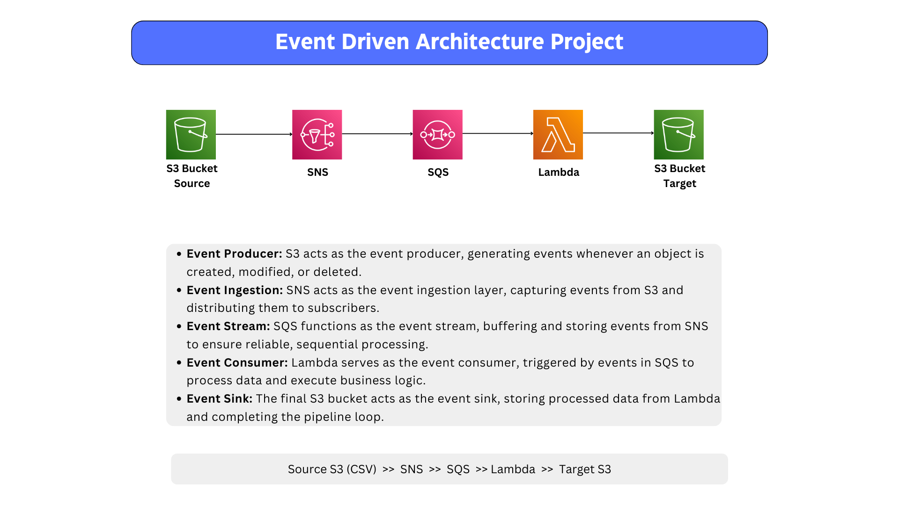
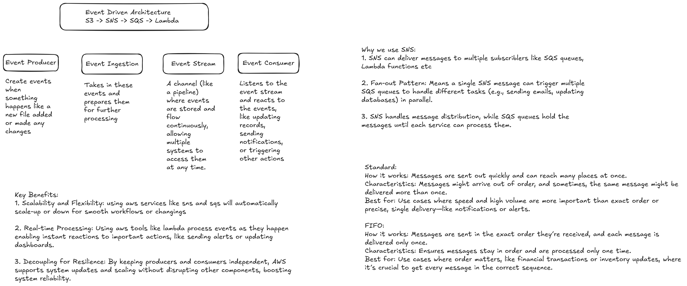

<h1 align="center">⚡ Event-Driven Data Pipeline on AWS</h1>

<p align="center">
  
  
  
  
  
</p>

A serverless **data engineering pipeline** that processes stock pricing CSV files using an event-driven architecture on AWS.
The project demonstrates how to build a reliable, decoupled data workflow using **Amazon S3, Amazon SNS, Amazon SQS, and AWS Lambda**. When a CSV file is uploaded to the source S3 path, an event is published, queued, processed by Lambda, transformed, and written back to the target S3 output path.

---

## 📌 Project Highlights

- 🧱 Built an event-driven AWS data pipeline using S3, SNS, SQS, and Lambda
- ⚙️ Processes CSV files automatically when new files arrive in S3
- 🧹 Performs data cleaning and transformation with Python
- 📬 Uses SQS to buffer events and improve reliability
- 🔔 Uses SNS to decouple event producers from event consumers
- 🗂️ Stores processed output back into S3
- 🔐 Includes sample IAM/SNS/SQS policy documents for AWS integration
- 📊 Uses stock pricing data as a sample data engineering use case

---

## 🏗️ Architecture Overview



### Architecture Flow

```text
Source S3 Bucket
      |
      v
S3 Event Notification
      |
      v
Amazon SNS Topic
      |
      v
Amazon SQS Queue
      |
      v
AWS Lambda Function
      |
      v
Target S3 Output Path
```

---

## 🧩 AWS Components and Responsibilities



| Layer | AWS Service | Responsibility |
|---|---|---|
| 📤 Event Producer | Amazon S3 | Detects new or changed files in the source input path |
| 📢 Event Router | Amazon SNS | Publishes S3 event notifications to subscribers |
| 📬 Event Buffer | Amazon SQS | Queues messages and improves delivery reliability |
| ⚙️ Processing Layer | AWS Lambda | Reads CSV files, transforms records, and writes output |
| 🗂️ Event Sink | Amazon S3 | Stores transformed output data |

---

## 🔄 Workflow

1. A CSV file is uploaded to the configured S3 input path.
2. S3 sends an event notification to an SNS topic.
3. SNS forwards the event message to an SQS queue.
4. Lambda is triggered by SQS messages.
5. Lambda reads the source CSV file from S3.
6. Python transformation logic cleans and enriches the data.
7. The transformed CSV is written to the S3 output path.

---

## 🧹 Data Transformations

The Lambda function applies several practical data engineering transformations:

| Transformation | Description |
|---|---|
| Date normalization | Converts dates from `MM/DD/YYYY` to `YYYY-MM-DD` |
| Volume validation | Replaces volume values below `100000` with `N/A` |
| Missing low price handling | Recalculates `low` using the average of `open` and `close` when low is `0` |
| Percentage change calculation | Adds `close_pct_change` using `((close - open) / open) * 100` |
| Processing timestamp | Adds a `created_at` timestamp to each processed row |

---

## 🛠️ Tech Stack

| Category | Tools / Services |
|---|---|
| Cloud Platform | AWS |
| Storage | Amazon S3 |
| Messaging | Amazon SNS, Amazon SQS |
| Compute | AWS Lambda |
| Programming | Python |
| Data Format | CSV |
| SDK | Boto3 |
| Security / Access | IAM Policies |

---

## 📁 Project Structure

```text
Event-Driven Data Pipeline AWS/
├── architecture-diagram.png
├── components.png
├── lambda_function.py
├── s3-to-lambda.py
├── stock_pricing.csv
├── policies/
│   ├── sns-policy-to-access-s3.json
│   └── sqs-policy-to-access-sns
├── .gitignore
├── LICENSE
└── README.md
```

---

## 🧠 Lambda Processing Logic

### Main pipeline Lambda

`lambda_function.py` is designed for the full event-driven flow:

```text
S3 → SNS → SQS → Lambda → S3
```

It reads the SQS message body, extracts the original S3 event, processes the uploaded CSV file, and writes the transformed output back to S3.

### Direct S3 trigger variant

`s3-to-lambda.py` is a simpler variant for direct event processing:

```text
S3 → Lambda → S3
```

This can be useful for learning, testing, or comparing direct and decoupled serverless event patterns.

---

## 🚀 Deployment Steps

### 1. Create S3 bucket paths

Create or configure an S3 bucket with input and output prefixes, for example:

```text
input/
output/
```

or, for the direct Lambda version:

```text
input_data/
output_data/
```

### 2. Create an SNS topic

Create an SNS topic that receives S3 event notifications.

### 3. Create an SQS queue

Create an SQS queue and subscribe it to the SNS topic.

### 4. Configure access policies

Use the policy examples inside the `policies/` folder as references:

```text
policies/sns-policy-to-access-s3.json
policies/sqs-policy-to-access-sns
```

> Replace sample ARNs, bucket names, account IDs, and regions with your own AWS values before deployment.

### 5. Create the Lambda function

Create an AWS Lambda function using Python and upload the contents of `lambda_function.py`.

Required Lambda permissions should allow:

- Reading objects from the source S3 path
- Writing objects to the output S3 path
- Reading messages from SQS
- Writing logs to CloudWatch

### 6. Add SQS trigger to Lambda

Configure the SQS queue as a trigger for the Lambda function.

### 7. Upload sample CSV file

Upload `stock_pricing.csv` into the configured input path and verify that the transformed output file appears in the output path.

---

## 🧪 Sample Input and Output

### Input

A stock pricing CSV file containing fields such as:

```text
date,open,high,low,close,volume
```

### Output

The processed output includes the original fields plus:

```text
close_pct_change,created_at
```

---

## ✅ What This Project Demonstrates

This project is suitable for a **Data Engineering / Cloud Engineering / AWS portfolio** because it demonstrates:

- Event-driven system design
- Serverless data processing
- Message-based architecture
- AWS service integration
- Python-based CSV transformation
- S3 data lake style input/output pattern
- Reliability improvement using queue-based processing
- Separation between ingestion, buffering, processing, and storage

---

## 🔐 Security Notes

- Do not commit AWS access keys, secret keys, or `.env` files.
- Replace all sample ARNs and account-specific values before using the policies.
- Use least-privilege IAM permissions for Lambda, S3, SNS, and SQS.
- Enable CloudWatch logging for monitoring and debugging.
- Consider adding S3 encryption and lifecycle rules for production use.

---

## 📈 Possible Improvements

Future enhancements can include:

- Infrastructure as Code using Terraform, AWS SAM, or CloudFormation
- Dead-letter queue for failed events
- CloudWatch alarms and monitoring dashboards
- Schema validation for incoming CSV files
- Unit tests for transformation functions
- Partitioned S3 output by date
- Integration with Athena, Glue, or Redshift for analytics

---

## 👤 Author

## 👤 Author

**Muhammad Ali Nawaz**  
Cloud Data Engineer

---

## 📄 License

This project is licensed under the [MIT license](LICENSE).

---

<p align="center">
  <b>⭐ If you like this project, consider starring the repository!</b>
</p>